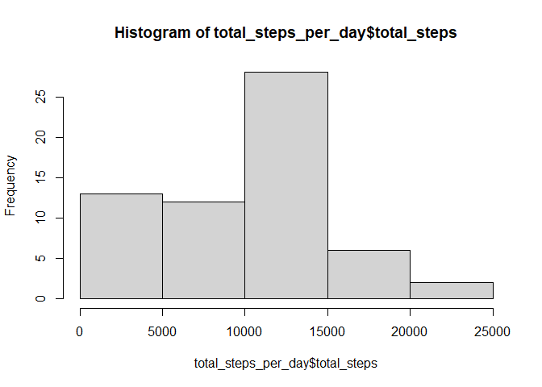
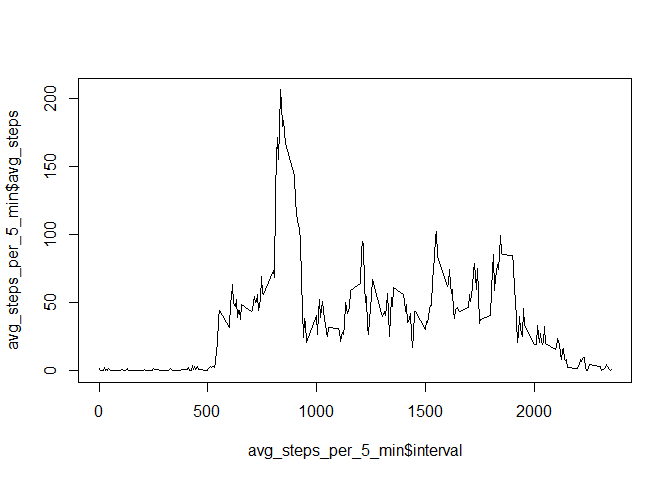
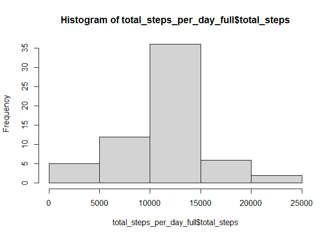
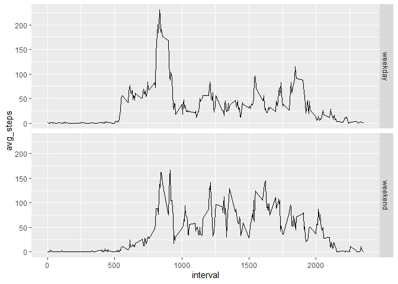

## Loading packages

```r
library(tidyverse)
```

```
## -- Attaching packages ------------------------------------------------ tidyverse 1.3.0 --
```

```
## v ggplot2 3.3.0     v purrr   0.3.4
## v tibble  3.0.0     v dplyr   0.8.5
## v tidyr   1.0.2     v stringr 1.4.0
## v readr   1.3.1     v forcats 0.5.0
```

```
## -- Conflicts --------------------------------------------------- tidyverse_conflicts() --
## x dplyr::filter() masks stats::filter()
## x dplyr::lag()    masks stats::lag()
```

## Loading and preprocessing the data

```r
activity <- read_csv("activity.csv")
```

```
## Parsed with column specification:
## cols(
##   steps = col_double(),
##   date = col_date(format = ""),
##   interval = col_double()
## )
```

## What is mean total number of steps taken per day?

```r
total_steps_per_day <- activity %>% group_by(date) %>% summarise(total_steps = sum(steps, na.rm = TRUE))
hist_steps <- hist(total_steps_per_day$total_steps)
```

<!-- -->

```r
mean(total_steps_per_day$total_steps, na.rm = TRUE)
```

```
## [1] 9354.23
```

```r
median(total_steps_per_day$total_steps, na.rm = TRUE)
```

```
## [1] 10395
```

## What is the average daily activity pattern?

```r
avg_steps_per_5_min <- activity %>% group_by(interval) %>% summarise(avg_steps = mean(steps, na.rm = TRUE))
plot(x = avg_steps_per_5_min$interval, y = avg_steps_per_5_min$avg_steps, type = "l")
```

<!-- -->

```r
avg_steps_per_5_min[which(avg_steps_per_5_min$avg_steps == max(avg_steps_per_5_min$avg_steps)), 'interval']
```

```
## # A tibble: 1 x 1
##   interval
##      <dbl>
## 1      835
```

## Imputing missing values

```r
total_NA <- sum(is.na(activity$steps))
activity_full <- activity %>% group_by(interval) %>% mutate(steps = replace_na(steps, mean(steps, na.rm = TRUE)))
total_steps_per_day_full <- activity_full %>% group_by(date) %>% summarise(total_steps = sum(steps))
hist_steps_full <- hist(total_steps_per_day_full$total_steps)
```

<!-- -->

```r
mean(total_steps_per_day_full$total_steps)
```

```
## [1] 10766.19
```

```r
median(total_steps_per_day_full$total_steps)
```

```
## [1] 10766.19
```

## Are there differences in activity patterns between weekdays and weekends?

```r
activity_full_mod <- cbind(activity_full, weekday = as.factor(ifelse(weekdays(as.Date(activity_full$date)) %in% c("Saturday", "Sunday"), "weekend", "weekday")))
activity_full_mod %>% group_by(weekday, interval) %>% summarise(avg_steps = mean(steps))%>% ggplot(aes(x = interval, y = avg_steps)) + geom_line() + facet_grid(rows = vars(weekday))
```

<!-- -->
